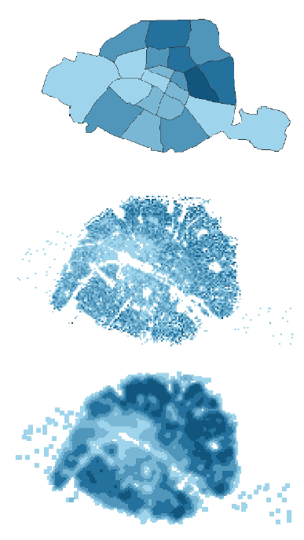
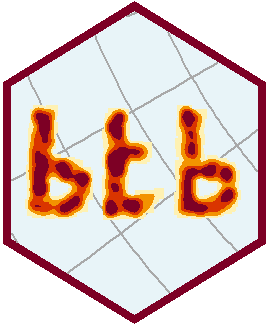
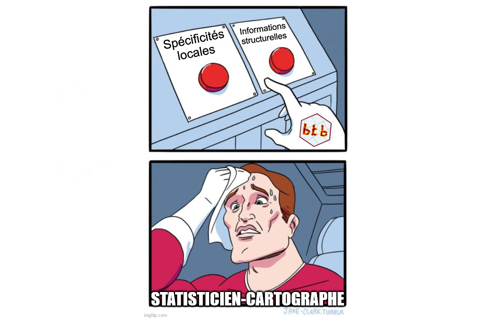

```{r xaringan-animate-all, echo=FALSE, eval = FALSE}
xaringanExtra::use_animate_all("fade")
```
```{r xaringan-scribble, echo=FALSE, eval = FALSE}
xaringanExtra::use_scribble()
```

class: inverse_sommaire, middle

| Numéro|Partie |
|-------|-------|
| 01| Lissage spatial avec `R` |
| 02| Exemple : les prix immobiliers à Paris en 2021 |


---
class: inverse

.partie[01]
.NumeroPartie[01]
.TitrePartie[Lissage spatial avec `R`]

---

.partie[01]
# Introduction

## 3 manières de cartographier les données ponctuelles

.left-column[


]

.right-column[


1. **Agrégation sur territoire administratif** : une partition irrégulière de l'espace. Plusieurs difficultés : essentiellement l'effet **MAUP** (*Modifiable areal unit problem*) ;</br></br></br>

2. **Agrégation sur grille carroyée** : un découpage régulier de l'espace en carreaux. Par construction, ces données peuvent être très erratiques ; </br></br></br>

3. **Lissage spatial** : une extension du carroyage consistant à décrire l'environnement d'une population dans un rayon donné.
]


???
- Il existe plusieurs manières de cartographier et interpréter des données ponctuelles.
- On peut citer 3 manières usuelles de procéder, au moins dans le cadre de l'analyse urbaine.

1) On peut agréger ces données dans des polygones s'apppuyant sur un découpage, généralement administratif du territoire (les départements, les communes, etc.).

Ces découpages de l'espace peuvent générer un effet MAUP (modifiable areal unit problem) et biaiser notre représentation des phénomène.
L'effet MAUP est dû au lien existant entre nos données et la forme des divisions administrative, mais aussi à l'echelle d'observation imposée par ses divisions du territoire.

2) Pour limiter les risques, une solution consiste à agréger et cartographier nos données en utilisant une grille carroyée régulière, avec une taille de carreau dépendant du phénomène observé et de l'échelle d'observation.

- Permet, par exemple, d'observer des phénomènes infracommunaux. 
- Néanmoins, aspect très erratique / limite l'interprétabilité de nos cartes.

3) Lissage spatial 
- Méthode clé pour analyser la répartition spatiale des données disponibles à un niveau géographique fin
- en fournissant une cartographie claire et simple
- débarrassée de l'arbitraire délimitations administratives.


---

.partie[01]
# Le package btb

## Pourquoi avoir développé BTB ?

--

Il existe d'autres packages de lissage : 

+ `KernSmooth`
+ `spatstat`... 

???

- Il existe d'autres packages pour faire du lissage spatial
- Notamment spatstats : 
  - très complet
  - permet notamment d'uiliser des algorithmes de choix du rayon de lissage optimal.

Mais utilisent les Transformations de fourier rapide, qui posent problème dans la gestion des effets de bord, particulièrement important en analyse urbaine.

--

Mais...

+ Souhait de lissage **conservatif** ;
+ Souhait de pouvoir gérer les **effets de bord** ;
+ Souhait de pouvoir **imposer une zone de lissage**
  + pas de taux de pauvreté dans la mer ! ;
  + résolution choisie
+ Souhait de faire du « lissage quantile » ;
+ Souhait de disposer d'un algorithme rapide.


---


.partie[01]
# Le package btb

.left-column[

]

.right-column[

## btb

+ Package R
+ Développé depuis 2018, par l'Insee
+ Mis à jour en 2022 (versions 0.2.0)
+ Cœur écrit en C++ (Rcpp)

➡️ Répond aux contraintes de l'analyse urbaine 

]

---

.partie[01]
# Le lissage spatial

.pull-left[

**Les paramétrage du lissage**

  + Un **noyau** (*kernel*) indiquant la manière d'approcher le voisinage ;
  
  + Le **rayon de lissage**, décrivant la taille du voisinage (arbitrage biais/variance) ;
  
  + La **résolution** ou le nombre de points sur lesquels des valeurs lissées seront estimées ;
  
  + La **gestion des effets de bord**, pour expliciter la manière dont les frontières géographiques et la zone d'observation sont prises en compte dans le lissage.

]

???

[Spatial smoothing is a non-parametric estimation method for the intensity function of a point process with observed values in R².]
In spatial smoothing, the intensity function in one point x is found by calculating the average points observed per unit surface on neighbourhoods containing x. 

And you have to determine various parameters: 
- the kernel which describes how the neighborhood is approached ;
- the bandwidth which is the size of this neighborhood
- the geographical level
- and how to deal or not with edge effects.

--

.pull-right[
**Dans btb...**
 
  + Méthode d'estimatation par _**noyau quadratique**_
  
  </br> 
  
  + Un paramètre de rayon de lissage
  
   </br>
  
  +  Un paramètre de _**taille des carreaux**_
  
   </br>
  
  + **Grille de lissage** paramétrable
]

---
class: inverse

.partie[02]
.NumeroPartie[02]
.TitrePartie[Exemple : les prix immobiliers à Paris en 2021]


---

.partie[02]
# La base de données


## « [**D**emandes de **V**aleurs **F**oncières](https://www.data.gouv.fr/fr/datasets/demandes-de-valeurs-foncieres-geolocalisees/) »,

- Base de données des transactions immobilières (maisons et appartements)
- En 2021
- Région parisienne
- Géolocalisée (1 transaction = 1 point géographique)

Variables utilisées dans notre exemple : 

-   `id_mutation` : identifiant de chaque transaction
-   `valeur_fonciere` : prix en euros
-   `surface_reelle_bati` : surface en m²
-   `x` : longitude (**projection Lambert 93**)
-   `y` : latitude (**projection Lambert 93**)

???

- Source "Demande de valeur foncière".
- Transactions immobilières en France 
  - ici uniquement Paris et petite couronne.
  - uniquement sur l'année 2021
- transactions géolocalisées.

Dans ce cas d'utilisation,
- Prix au mètre-carré
- Dans Paris intramuros

```{r message=FALSE, warning=FALSE, echo=FALSE, eval=TRUE}
## Liste des librairies utilisées
packages <-  c("dplyr","sf","btb","mapsf","leaflet","mapview","kableExtra","magrittr")
## Vérifier si la librairie est installée, si non l'installer, puis la charger
package.check <- lapply(
  packages,
  FUN = function(x) {
    if (!require(x, character.only = TRUE)) {
      install.packages(x, dependencies = TRUE, quiet = TRUE)
      library(x, character.only = TRUE)
    }
  }
)
```


---

.partie[02]
# Chargement des données

.pull-left[
## Chargement des fonds de carte


```{r, eval=T, echo=TRUE, warning=FALSE,message=FALSE,results = 'hide'}
url_suburbs <-"https://minio.lab.sspcloud.fr/projet-formation/r-lissage-spatial/depCouronne.gpkg"
suburbs_sf <- sf::st_read(url_suburbs)
```

```{r, eval=TRUE, echo=TRUE, fig.height=4}
suburbs_sf <- suburbs_sf %>% 
  rename(geometry=geom)
```

```{r mapdepartements, echo=F,out.height="200px"}
mapview(suburbs_sf$geometry)
```


]

.pull-right[

## Chargement des données

```{r, eval=TRUE, echo=TRUE}
url_file <- url("https://minio.lab.sspcloud.fr/projet-formation/r-lissage-spatial/ventesImmo_couronneParis.RDS")
dfBase <- readRDS(url_file)
dfBase <- dfBase[,c("id_mutation",
                    "valeur_fonciere",
                    "surface_reelle_bati",
                    "x","y")]
```

```{r, echo=F}
kableExtra::kbl(head(dfBase,5)) %>% scroll_box(width = "500px", height = "200px")
```

]

???

First, we import layer to get Paris boundaries. 
Here, you can see the 3 departments called Petite Couronne. It's the dense urbain area around the town of Paris (the polygon in the middle).

Secondly, we import our transactions data and we select the useful variables. 

---

.partie[02]

# Filtrer les données et gérer les effets de bord

.pull-left[
**1.**  Transformation des observations en points géométriques

```{r selectDonnee2a, eval=TRUE}
sfBase <- sf::st_as_sf(dfBase,
                       coords = c("x", "y"),
                       crs = 2154)
```


**2.**  Zone tampon autour de Paris

```{r selectDonnee2b, eval=TRUE}
paris_sf <- suburbs_sf %>% filter(code=="75")
buffer_sf <- st_buffer(paris_sf,dist = 2000)
```


**3.** Sélection par intersection géographique

```{r selectDonnee2c, eval=TRUE}
sfBase_buffer <- st_join(sfBase, buffer_sf,
                         left=FALSE)
```
]

.pull-right[
```{r, echo=FALSE, eval=TRUE}
# Mise en forme de la couche buffer
buffer_sf$nom <- "buffer"
buffer_line <- buffer_sf %>% st_cast("MULTILINESTRING")
# Échantillon de 2000 observations dans le buffer
sfBase_sample <- sfBase_buffer[sample(1:nrow(sfBase_buffer),2000) ,]
# Cartographie pédagogique avec mapview
mapview(paris_sf ,col.regions= "#26cce7")+
  mapview(buffer_line,color="#FFC300",lwd=6)+
  mapview(sfBase_sample,#col.regions = "black",alpha.regions=0.5,
          alpha=0,cex=2)
```
]


???

Handling potential edge effects is an important part of spatial smoothing. 
Here, we are only interested about prices inside Paris Town.
Anyway, it can be important (and sometimes mandatory) to use data beyond the very border of your studied zone. Otherwise, it can generate artifacts on the edge of this zone.

That's why we'll smooth the transactions in Paris plus a buffer (here 2000 meters).
On the left, you can see a way to handle it. 

---

.partie[02]
# Étape 0 : Carroyage (facultatif)

.pull-left[

+ Pour bien maîtriser son jeu de données avant lissage : commencer par **carroyer les données** !

</br>

+ Très facile avec les fonctions intégrées à `btb` : 
  + `btb_add_centroids`
  + `btb_ptsToGrid`

➡️ Calculons les prix moyens au mètre-carré (parmis les transactions de 2021) sur des carreaux de 50m de côté

]

.pull-right[

```{r carroyage, eval=TRUE,include=FALSE}
iCellSize = 200 # Square of 200 meters
points_carroyage <- btb::btb_add_centroids(pts = sfBase_buffer,iCellSize = iCellSize) 
points_centroides <- points_carroyage %>%
  st_drop_geometry() %>% 
  group_by(x_centro,y_centro) %>% 
  summarise(sum_surf=sum(surface_reelle_bati),
            sum_price=sum(valeur_fonciere)) %>% 
  ungroup() %>% 
  mutate(price_per_sqrmeter=sum_price/sum_surf)
carreaux <- btb::btb_ptsToGrid(pts = points_centroides,
                          sEPSG = "2154", iCellSize = iCellSize)
carreaux <- carreaux %>% st_join(paris_sf,left=F)
```

```{r carroyage5, eval=TRUE, echo=FALSE}

contourParis <- st_cast(paris_sf[,c("geometry")],"MULTILINESTRING")
mf_init(x=carreaux,theme = "agolalight")
mf_map(x = carreaux,
       type = "choro",
       var="price_per_sqrmeter",
       breaks = "quantile",
       border = NA, 
       nbreaks = 5,
       lwd=1,
       leg_val_rnd = 1,
       add = TRUE)
mf_map(x = contourParis,
       lwd=4,
       col="black",add = TRUE)
mf_layout(title = "Mean price per m²",
          credits = "Insee-DSAU, DGFiP, Etalab, IGN, mapsf")
```
]

???

Now, you could directly smooth your data and get the result.
But, to better understand your data, you can use a grid and calculate mean prices inside all the cells (here with 50 meters squares).

The package makes it very easy using the following functions. 

The result is far from synthetic (and beautiful) : but still, it's a first insight !
For example, it seems that prices are much higher in the center and the west than on the borders of the city and on the north east.

---

.partie[02]
# Lissage [1/3]

## Lissage spatial avec `btb::btb_smooth`

<small>
-   `pts` : table des points avec uniquement des variables numériques (objet geometrique ou non) ;
-   `iCellSize` : Taille des carreaux en mètres (granularité de la grille des résultats) ;
-   `iBandwidth` : Rayon de lissage en mètres.
</small>

```{r lissAuto800,  results='hide', eval=TRUE}
pts <- sfBase_buffer[,c("valeur_fonciere","surface_reelle_bati")]
smooth_result <- btb::btb_smooth(pts = pts, 
                              iCellSize = 50, 
                              iBandwidth = 800)
```

```{r showSmoothed1,  echo=FALSE,out.height="100px"}
kbl(slice_sample(smooth_result, n = 50)) %>%
  scroll_box(height = "200px")
```

???

Now, let's smooth your data.
We'll use the btb_smooth function, the most important function of the BTB package. 

In this example, we only need 3 parameters : 
......

- we select prices and surfaces for our transactions
- we smooth it

Let's take a look at the output

- This is a sf table, a table of geometric square cells
- Price and surface variables have been smoothed.


---

.partie[02]
# Lissage [2/3]


.pull-left[
## Obtenir les prix au m² lissés


```{r getprice}
smooth_result <- smooth_result %>% 
  mutate(smooth_price=
    valeur_fonciere / surface_reelle_bati)
```


## Ne conserver que les estimations lissées à l'intérieur de Paris

```{r filtreParis}
smooth_result <- smooth_result %>% 
  st_join(paris_sf[,"geometry"],left=F)
```

<!-- ```{r showSmoothed,  echo=FALSE} -->
<!-- kbl(smooth_result[1:50,]) %>% -->
<!--   scroll_box(width = "500px", height = "500px") -->
<!-- ``` -->

]

.pull-right[

## Cartographier le résultat
```{r resLissAuto800, echo=FALSE, eval=TRUE, fig.height=5}

# Carte lissée
mf_init(x=smooth_result,theme = "agolalight")
mf_map(x = smooth_result, 
       type = "choro",
       var="smooth_price",
       breaks = "quantile",
       border = NA, # C'est ici que ça se passe
       nbreaks = 5,
       lwd=1,
       leg_pos="topright",
       add = TRUE)
mf_map(x = contourParis, 
       lwd=4,
       col="black",add = TRUE)
mf_layout(title = "Smoothed prices (800m bandwidth)",
          credits = "Insee-DSAU, DGFiP, Etalab, IGN, mapsf")
```

]

???

Then : 

- we calculate the smoothed ratio : the smoothed price per square meters
- And, finally, we only keep the results in Paris using geographic intersection.

The map shows a spatially smoothed representation of prices for each square meters sold in Paris in 2021.


---

.partie[02]
# Lissage [3/3]

## Avec différents rayons de lissage (arbitrage biais-variance)

.pull-left[


```{r resLissAuto400, echo=FALSE, eval=TRUE, fig.height=5}
sfCarrLiss <- btb::btb_smooth(pts = pts, 
                                    iCellSize = 50, 
                                    iBandwidth = 400)

smooth_result <- sfCarrLiss %>% st_join(paris_sf[,"geometry"],left=F)
smooth_result <- smooth_result %>% mutate(smooth_price=valeur_fonciere / surface_reelle_bati)

# Carte lissée
mf_init(x=smooth_result,theme = "agolalight")
mf_map(x = smooth_result, 
       type = "choro",
       var="smooth_price",
       breaks = "quantile",
       border = NA, 
       nbreaks = 5,
       lwd=1,
       leg_pos="topright",
       add = TRUE)
mf_map(x = contourParis, 
       lwd=4,
       col="black",add = TRUE)
mf_layout(title = "Smoothed prices (400m bandwidth)",
          credits = "Insee-DSAU, DGFiP, Etalab, IGN, mapsf")
```

]

.pull-right[


```{r resLissAuto1200, echo=FALSE, eval=TRUE, fig.height=5}
sfCarrLiss <- btb::btb_smooth(pts = pts, 
                                    iCellSize = 50, 
                                    iBandwidth = 1200)

smooth_result <- sfCarrLiss %>% st_join(paris_sf[,"geometry"],left=F)
smooth_result <- smooth_result %>% mutate(smooth_price=valeur_fonciere / surface_reelle_bati)

# Carte lissée
mf_init(x=smooth_result,theme = "agolalight")
mf_map(x = smooth_result, 
       type = "choro",
       var="smooth_price",
       breaks = "quantile",
       border = NA, 
       nbreaks = 5,
       lwd=1,
       leg_pos="topright",
       add = TRUE)
mf_map(x = contourParis, 
       lwd=4,
       col="black",add = TRUE)
mf_layout(title = "Smoothed prices (1200m bandwidth)",
          credits = "Insee-DSAU, DGFiP, Etalab, IGN, mapsf")
```

]

???

Depending whether you want structural or specific results, you can choose a wider or a smaller bandwidth.


---

.partie[02]
# Lissage [3/3]

<!--  -->
```{r echo=FALSE, out.width = "78%", fig.align='center'}


```

---

.partie[02]
# Retrouver BTB


.pull-left[

## `btb`  disponible sur le CRAN et sur Github

```{r,eval=F}
install.packages("btb")
```

## Trouver toute la documentation :


➡️ [Site web](https://inseefr.github.io/btb/) de `btb`

➡️ [Manuel](https://www.insee.fr/fr/information/3635442) d'analyse spatiale de l'Insee 

➡️ [Auto-formation](https://github.com/InseeFrLab/formation-r-lissage-spatial)

</br>

## Et n'hésitez pas à nous contacter !

➡️  <analyse-urbaine@insee.fr>
]

.pull-right[
## Merci pour votre attention !


]

---
class: thanks, center, middle

## Retrouvez-nous sur :
[</img>](https://insee.fr/fr/accueil)&emsp;
[</img>](https://twitter.com/InseeFr)&emsp;
[</img>](https://www.youtube.com/channel/UChCCvJTbZEYsCXyfu27eQ6g)&emsp;
[</img>](https://www.linkedin.com/company/insee)


```{block type='auteur'}
Kim Antunez <br>
Julien Pramil <br>
Insee, France <br>
<analyse-urbaine@insee.fr>

```

.rappel_contexte[`r rmarkdown::metadata$institute`]
