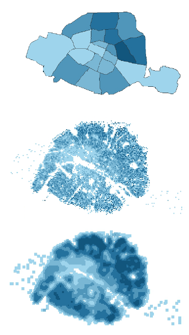

```{r xaringan-animate-all, echo=FALSE}
xaringanExtra::use_animate_all("fade")
```
```{r xaringan-scribble, echo=FALSE}
xaringanExtra::use_scribble()
```

class: inverse_sommaire, middle

| Numéro|Partie |
|-------|-------|
| 01| Spatial smoothing with `R` |
| 02| Example: the housing prices in Paris in 2021 |


---
class: inverse

.partie[01]
.NumeroPartie[01]
.TitrePartie[Spatial smoothing with `R`]

---

.partie[01]
# Introduction

## 3 ways of mapping geographical data

.left-column[


]

.right-column[


1. **The territory**: a non-regular division of space. Several
difficulties: mainly the Modifiable areal unit problem (MAUP) effect ;</br></br></br>

2. **The grid**: a regular division of space in the form
of a grid of square cells. By construction, the
gridded data can be very erratic ; </br></br></br>

3. **Spatial smoothing**: an extension of gridding
consisting in describing the population environment within a given radius.
]


???
 
Spatial smoothing is a key method for analyzing spatial organization of data available at a small geographic level. Its aim is to provide simplified, clear mapping, relieved of the arbitrariness of territorial boundary lines ("Modifiable Area Units Problem" effect).

non-parametric estimation method for the intensity function of a point process with observed values in R². The theoretical intensity function in one point x is found by calculating the average points observed per unit surface on neighbourhoods containing x 

---

.partie[01]
# btb R package

.pull-left[
## Existing packages

+ `KernSmooth`
+ `spatstat`... 

➡️ Often, **Fast Fourier Transform**.

Not suitable for **border effects**


</br>

## btb

+ developed in 2018 (Insee, France)

+ deals with edge effects

+ allows quantile smoothing (less sensitive to extreme values)

+ developed in C++ (`Rcpp`)
]
.pull-right[

]

???
Several R packages make it possible to perform smoothing. For example, the spatstat package dedicated to the analysis of spatial point processes is very complete. It includes a smoothing function (density.ppp) and various functions for choosing optimal bandwidths (bw.diggle, bw.frac...). 

Often, these functions rely on a Fast Fourier Transform to calculate the convolution
(mathematical name of smoothing). By construction, this process is not suitable for situations where border effects** are important...

The btb ("beyond the border") R package, developed in 2018 by the French National Institute of Statistics and Economic Studies (Insee)

The btb package also makes it possible to use quantile smoothing, which has the advantage of being less sensitive to extreme values and thus enriches the analysis of some variables, in particular income variables.

R software is very polyvalent and has a very flexible grammar but
on the other hand it is slow. To circumvent this limitation, the btb package has been developed
in C++ using the `Rcpp` package. => We thus benefit from the R Syntax and the power of C++ with a relatively modest development cost.


---

.partie[01]
# Spatial smoothing

.pull-left[

**Choice of parameters**

  + The **kernel** describes how the neighborhood is approached ;
  
  + The **bandwidth** quantifies the "size" of this neighborhood (to be chosen according to a bias/variance trade-off) ;
  
  + The **geographical level** from which the smoothed values are estimated ;
  
  + The **treatment of edge effects** makes explicit how geographical boundaries and the limits of observation territory are taken into account in the analysis.

]

--

.pull-right[
**In btb...**
 
  + _**quadratic kernel** estimation method_
  
  </br> 
  
  + _a **variable bandwidth**_
  
   </br>
  
  +  _**square** whose size can be chosen_
  
   </br>
  
  + _taken into account. **conservative method**_
]


???

conservative method : before and after smoothing, the number of points observed is identical.

---
class: inverse

.partie[02]
.NumeroPartie[02]
.TitrePartie[Example: the housing prices in Paris in 2021]

---

.partie[02]
# Find BTB

## BTB available on Cran and Github

```{r,eval=F}
install.packages("btb")
```

## Find all the documentation you need

Please visit BTB website : 

➡️ https://inseefr.github.io/btb/


## And do not hesitate to contact us !

➡️  psar-au@insee.fr

---

.partie[02]
# Database


## « [**D**emandes de **V**aleurs **F**oncières](https://www.data.gouv.fr/fr/datasets/demandes-de-valeurs-foncieres-geolocalisees/) »,

- Real-estate sales database (houses and apartments)
- In 2021
- Paris region
- Geolocalized (1 sale = 1 geographic point)

Variables used in the following example : 

-   `id_mutation` : id for each sale
-   `valeur_fonciere` : price
-   `surface_reelle_bati` : surface in square meters
-   `x` : longitude (**Lambert 93 projection**)
-   `y` : latitude (**Lambert 93 projection **)

???

In this example, we will extract our data from the source "Demande de valeur foncière".
This source gives information about real estate sales in France.
In particular, the sales are geolocalized thanks to the longitude and latitude variables.

We'll show how to smooth prices per square meters in the town of Paris in 2021. 


```{r message=FALSE, warning=FALSE, echo=FALSE, eval=TRUE}
## Liste des librairies utilisées
packages <-  c("dplyr","sf","btb","mapsf","leaflet","mapview","kableExtra","magrittr")
## Vérifier si la librairie est installée, si non l'installer, puis la charger
package.check <- lapply(
  packages,
  FUN = function(x) {
    if (!require(x, character.only = TRUE)) {
      install.packages(x, dependencies = TRUE, quiet = TRUE)
      library(x, character.only = TRUE)
    }
  }
)
```


---

.partie[02]
# Load data

.pull-left[
## Load map layer


```{r, eval=T, echo=TRUE, warning=FALSE,message=FALSE,results = 'hide'}
url_suburbs <-"https://minio.lab.sspcloud.fr/projet-formation/r-lissage-spatial/depCouronne.gpkg"
suburbs_sf <- sf::st_read(url_suburbs)
```

```{r, eval=TRUE, echo=TRUE, fig.height=4}
suburbs_sf <- suburbs_sf %>% 
  rename(geometry=geom)
```

```{r mapdepartements, echo=F,out.height="200px"}
mapview(suburbs_sf$geometry)
```


]

.pull-right[

## Load database

```{r, eval=TRUE, echo=TRUE}
url_file <- url("https://minio.lab.sspcloud.fr/projet-formation/r-lissage-spatial/ventesImmo_couronneParis.RDS")
dfBase <- readRDS(url_file)
dfBase <- dfBase[,c("id_mutation","valeur_fonciere","surface_reelle_bati","x","y")]

```

```{r, echo=F}
kableExtra::kbl(head(dfBase,5)) %>% scroll_box(width = "500px", height = "200px")
```

]

???

First, we import layer to get Paris boundaries. 
Here, you can see the 3 departments called Petite Couronne. It's the dense urbain area around the town of Paris (the polygon in the middle).

Secondly, we import our sales data and we select the useful variables. 
---

.partie[02]
# Select data et deals with edge effects

.pull-left[
**1.**  Transform observations into geometric points

```{r selectDonnee2a, eval=TRUE}
sfBase <- sf::st_as_sf(dfBase,
                       coords = c("x", "y"),
                       crs = 2154)
```


**2.**  Buffer zone

```{r selectDonnee2b, eval=TRUE}
paris_sf <- suburbs_sf %>% filter(code=="75")
buffer_sf <- st_buffer(paris_sf,dist = 2000)
```


**3.** Geographical intersection

```{r selectDonnee2c, eval=TRUE}
sfBase_buffer <- st_join(sfBase, buffer_sf,
                         left=FALSE)
```
]

.pull-right[
```{r, echo=FALSE, eval=TRUE}
# Mise en forme de la couche buffer
buffer_sf$nom <- "buffer"
buffer_line <- buffer_sf %>% st_cast("MULTILINESTRING")
# Échantillon de 2000 observations dans le buffer
sfBase_sample <- sfBase_buffer[sample(1:nrow(sfBase_buffer),2000) ,]
# Cartographie pédagogique avec mapview
mapview(paris_sf ,col.regions= "#26cce7")+
  mapview(buffer_line,color="#FFC300",lwd=6)+
  mapview(sfBase_sample,#col.regions = "black",alpha.regions=0.5,
          alpha=0,cex=2)
```
]


???

Handling potential edge effects is an important part of spatial smoothing. 
Here, we are only interested about prices inside Paris Town.
Anyway, it can be important (and sometimes mandatory) to use data beyond the very border of your studied zone. Otherwise, it can generate artifacts on the edge of this zone.

That's why we'll smooth the sales in Paris plus a buffer (here  2000 meters).
On the left, you can a way to handle it. 

---

.partie[02]
# Step 0 : Cells aggregations

.pull-left[

+ Better understand your data before smoothing it : **aggregation** inside grid cells !
+ It's really easy using `btb` functions such as : 
  + `btb_add_centroids`
  + `btb_ptsToGrid`

➡️ Let's calculate the mean price per square meters (among 2021 sells) : 

]

.pull-right[

```{r carroyage, eval=TRUE,include=FALSE}
iCellSize = 200 # Square of 200 meters
points_carroyage <- btb::btb_add_centroids(pts = sfBase_buffer,iCellSize = iCellSize) 
points_centroides <- points_carroyage %>%
  st_drop_geometry() %>% 
  group_by(x_centro,y_centro) %>% 
  summarise(sum_surf=sum(surface_reelle_bati),
            sum_price=sum(valeur_fonciere)) %>% 
  ungroup() %>% 
  mutate(price_per_sqrmeter=sum_price/sum_surf)
carreaux <- btb::btb_ptsToGrid(pts = points_centroides,
                          sEPSG = "2154", iCellSize = iCellSize)
carreaux <- carreaux %>% st_join(paris_sf,left=F)
```

```{r carroyage5, eval=TRUE, echo=FALSE}

contourParis <- st_cast(paris_sf[,c("geometry")],"MULTILINESTRING")
mf_init(x=carreaux,theme = "agolalight")
mf_map(x = carreaux,
       type = "choro",
       var="price_per_sqrmeter",
       breaks = "quantile",
       border = NA, 
       nbreaks = 5,
       lwd=1,
       leg_val_rnd = 1,
       add = TRUE)
mf_map(x = contourParis,
       lwd=4,
       col="black",add = TRUE)
mf_layout(title = "Mean price per m²",
          credits = "Insee-DSAU, DGFiP, Etalab, IGN, mapsf")
```
]

???

Now, you could directly smooth your data and get the result.
But, to better understand your data, you can use a grid and calculate mean prices inside all the cells (here with 50 meters squares).

The package makes it very easy using the following functions. 

The result is far from synthetic (and beautiful) : but still, it's a first insight !
For example, it seems that prices are much higher in the center and the west than on the borders of the city and on the north east.

---

.partie[02]
# Smothing [1/3]


**2.** Spatial smoothing with `btb::btb_smooth`
<small>
-   `pts` : table of points with only numeric variables (geometric object or not) ;
-   `iCellSize` : cell size in meters (granularity of the underlying grid) ;
-   `iBandwidth` : smoothing bandwidth in meters.
</small>

```{r lissAuto800,  results='hide', eval=TRUE}
pts <- sfBase_buffer[,c("valeur_fonciere","surface_reelle_bati")]
smooth_result <- btb::btb_smooth(pts = pts, 
                              iCellSize = 50, 
                              iBandwidth = 800)
```

```{r showSmoothed1,  echo=FALSE,out.height="100px"}
kbl(smooth_result[1:50,]) %>%
  scroll_box(height = "200px")
```

???

Now, let's smooth your data.
We'll use the btb_smooth function, the most important function of the BTB package. 

In this example, we only need 3 parameters : 
......

- we select prices and surfaces for our sales
- we smooth if

Let's take a look at the output

- This is a sf table, a table of geometric square cells
- Price and surface variables have been smoothed.


---

.partie[02]
# Smothing [2/3]


.pull-left[
## Get the smoothed prices per m²


```{r getprice}
smooth_result <- smooth_result %>% 
  mutate(smooth_price=
           valeur_fonciere / surface_reelle_bati)
```


## Only keep the cells inside Paris

```{r filtreParis}
smooth_result <- smooth_result %>% 
  st_join(paris_sf[,"geometry"],left=F)
```

<!-- ```{r showSmoothed,  echo=FALSE} -->
<!-- kbl(smooth_result[1:50,]) %>% -->
<!--   scroll_box(width = "500px", height = "500px") -->
<!-- ``` -->

]

.pull-right[

## Map the result :
```{r resLissAuto800, echo=FALSE, eval=TRUE}

# Carte lissée
mf_init(x=smooth_result,theme = "agolalight")
mf_map(x = smooth_result, 
       type = "choro",
       var="smooth_price",
       breaks = "quantile",
       border = NA, # C'est ici que ça se passe
       nbreaks = 5,
       lwd=1,
       add = TRUE)
mf_map(x = contourParis, 
       lwd=4,
       col="black",add = TRUE)
mf_layout(title = "Smoothed prices (800m bandwidth)",
          credits = "Insee-DSAU, DGFiP, Etalab, IGN, mapsf")
```

]

???

Then : 

- we calculate the smoothed ratio : the smoothed price per square meters
- And, finally, we only keep the results in Paris using geographic intersection.

The map shows a spatially smoothed representation of prices for each square meters sold in Paris in 2021.


---

.partie[02]
# Smothing [3/3]

## Possible with different bandwidths

.pull-left[


```{r resLissAuto400, echo=FALSE, eval=TRUE}
sfCarrLiss <- btb::btb_smooth(pts = pts, 
                                    iCellSize = 50, 
                                    iBandwidth = 400)

smooth_result <- sfCarrLiss %>% st_join(paris_sf[,"geometry"],left=F)
smooth_result <- smooth_result %>% mutate(smooth_price=valeur_fonciere / surface_reelle_bati)

# Carte lissée
mf_init(x=smooth_result,theme = "agolalight")
mf_map(x = smooth_result, 
       type = "choro",
       var="smooth_price",
       breaks = "quantile",
       border = NA, 
       nbreaks = 5,
       lwd=1,
       add = TRUE)
mf_map(x = contourParis, 
       lwd=4,
       col="black",add = TRUE)
mf_layout(title = "Smoothed prices (400m bandwidth)",
          credits = "Insee-DSAU, DGFiP, Etalab, IGN, mapsf")
```

]

.pull-right[


```{r resLissAuto1200, echo=FALSE, eval=TRUE}
sfCarrLiss <- btb::btb_smooth(pts = pts, 
                                    iCellSize = 50, 
                                    iBandwidth = 1200)

smooth_result <- sfCarrLiss %>% st_join(paris_sf[,"geometry"],left=F)
smooth_result <- smooth_result %>% mutate(smooth_price=valeur_fonciere / surface_reelle_bati)

# Carte lissée
mf_init(x=smooth_result,theme = "agolalight")
mf_map(x = smooth_result, 
       type = "choro",
       var="smooth_price",
       breaks = "quantile",
       border = NA, 
       nbreaks = 5,
       lwd=1,
       add = TRUE)
mf_map(x = contourParis, 
       lwd=4,
       col="black",add = TRUE)
mf_layout(title = "Smoothed prices (1200m bandwidth)",
          credits = "Insee-DSAU, DGFiP, Etalab, IGN, mapsf")
```

]

???

Depending weather you want structural or specific results, you can choose a wider or a smaller bandwidth.


---

.partie[02]
# Thank you for your attention !

<center>
</img>
</br>
<a>https://github.com/InseeFr/btb</a>
</center>

---
class: thanks, center, middle

## Find us on:
[</img>](https://insee.fr/fr/accueil)&emsp;
[</img>](https://twitter.com/InseeFr)&emsp;
[</img>](https://www.youtube.com/channel/UChCCvJTbZEYsCXyfu27eQ6g)&emsp;
[</img>](https://www.linkedin.com/company/insee)


```{block type='auteur'}
Kim Antunez <br>
Julien Pramil <br>
Insee, France <br>
<psar-au@insee.fr>

```

.rappel_contexte[`r rmarkdown::metadata$institute`]
